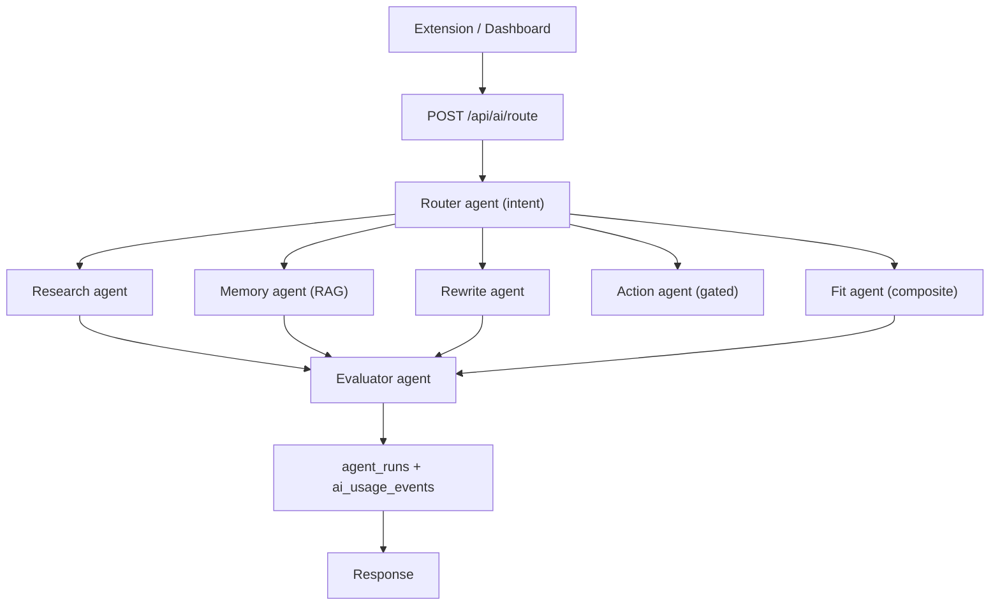

# Inline

Inline is a workspace and Chrome extension for capturing, annotating, rewriting, and organizing web context. The current source of truth for the product lives on `feature/inline-website`; `main` is behind this branch.

## What Is In This Repo

- `web/` - Next.js workspace app, marketing site, dashboard, document editor, library, history, analytics, settings, AI API routes, and the multi-agent AI system (`web/lib/ai/`).
- `backend/` - Express API used by the extension for annotation persistence.
- `inlineExtension/` - Chrome extension built with React and Vite. It injects the Inline dock, selection tools, AI panels, notes, drawings, handwriting, stamps, search, layers, sharing, and browser-page overlays.
- `supabase/` - Database migrations for extension persistence, workspace data, RAG/search support, and agent run/usage logging.

## Core Features

- Chrome extension dock with AI, rewrite, search, annotation, drawing, handwriting, screenshot, layers, share, and settings.
- Persistent webpage annotations including highlights, sticky notes, paper notes, drawings, handwriting, stamps, and AI replacements.
- Workspace dashboard for activity, library documents, captures, analytics, settings, and source-backed briefs.
- AI capabilities for page recap, rewrite, insight generation, page risk, RAG indexing, search, and text-to-speech.
- Supabase-backed persistence and workspace synchronization.

## Multi-Agent AI Architecture

Inline's AI is a lightweight, provider-agnostic multi-agent system written entirely in TypeScript inside `web/`. A router classifies each request, a specialized agent handles it (reusing the existing RAG pipeline), an evaluator checks the output, and every run is persisted with token/latency metrics so a usage dashboard can surface adoption and value.



### Components

- Provider layer (`web/lib/ai/providers/`): `getModel({ role })` resolves a model across Gemini / OpenAI / Anthropic with a Gemini fallback; every model id is env-overridable.
- Router (`web/lib/ai/agents/routerAgent.ts`): explicit intent wins, then a fast LLM classifier, then keyword heuristics.
- Agents (`web/lib/ai/agents/`): `research`, `memory` (RAG), `rewrite`, `action` (state-changing, confirmation-gated), `fit` (composite role-fit), and `evaluator` (guardrail).
- Tools (`web/lib/ai/tools/`): `searchMemories` (RAG), `getRecentNotes`, `saveNote`, `getCurrentPage`, `exportToNotion`.
- Orchestrator (`web/lib/ai/agents/orchestrator.ts`): route -> run -> evaluate -> aggregate usage.

### Endpoints

- `POST /api/ai/route` - the coordinator. Body: `{ userPrompt, selectedText?, pageUrl?, pageTitle?, pageContent?, workspaceId?, intent?, confirm?, params?, surface? }`.
- `POST /api/automation/internship` - the Internship Tracker automation (career-fit + structured extraction + optional Notion export + logged run).
- `GET/POST/DELETE /api/integrations/notion` - connect / test / disconnect a Notion database.

### RAG (reused)

Agents reuse the existing pipeline in `web/lib/ai/rag/`: `workspace_embeddings` (pgvector, 768-dim) with the `match_workspace_embeddings` RPC and a recency fallback.

### Persistence

`supabase/migrations/2026_06_28_agents.sql` adds `agent_runs`, `ai_usage_events`, `agent_sessions`, `agent_messages`, `integration_connections`, and `automation_runs` - all owner-only via RLS.

### Usage dashboard

`/app/<workspace>/usage` (sidebar -> Usage) shows runs by agent, token usage, time saved, evaluation pass rate, and runs grouped by activity category.

### Evals

`web/lib/ai/evals/cases.json` plus `npm run evals` (from `web/`) exercise router, evaluator-guardrail, and agent checks; results are written to `web/lib/ai/evals/results/latest.json`.

### Configuration (env, `web/.env.local`)

- `GOOGLE_GENERATIVE_AI_API_KEY` - required (default provider and embeddings).
- `OPENAI_API_KEY`, `ANTHROPIC_API_KEY` - optional alternate providers.
- `AI_PROVIDER` - `google` (default) | `openai` | `anthropic`.
- `AI_MODEL_<PROVIDER>_<FAST|SMART>` - optional model id overrides.

### Demo: "Is this role a fit?"

On any job posting, open the extension AI panel and choose "Is this role a fit?". The fit agent extracts the role requirements, the memory agent retrieves your saved background, and the evaluator checks the grounded result - the same flow the Internship Tracker automation runs and logs.

## Local Development

Install dependencies in the relevant package folders:

```bash
npm install
cd web && npm install
cd ../backend && npm install
cd ../inlineExtension && npm install
```

Configure AI + Supabase env in `web/.env.local` (see `web/.env.local.example`). At minimum set `GOOGLE_GENERATIVE_AI_API_KEY` and the Supabase keys; `OPENAI_API_KEY` / `ANTHROPIC_API_KEY` are optional. Apply the Supabase migrations in `supabase/migrations/` (including `2026_06_28_agents.sql`) before using the agent run/usage features.

Run the web app:

```bash
cd web
npm run dev
```

Run the backend:

```bash
cd backend
npm run dev
```

Build the Chrome extension:

```bash
cd inlineExtension
npm run build
```

Load the unpacked extension from `inlineExtension/dist` in Chrome after building.

## Useful URLs

- Web app: `http://localhost:3000`
- Backend API: `http://localhost:3030`
- Extension build output: `inlineExtension/dist`
- Privacy policy: `http://localhost:3000/privacy`

## Extension Privacy Notes

- The extension has a first-run disclosure before capture or AI actions are available.
- Guest/local captures save to browser storage and use encrypted annotation records.
- Signed-in captures sync to the active workspace over secure non-local transport.
- The Chrome Web Store listing should use `/privacy` as the privacy policy URL and mirror the permission reasons in `inlineExtension/README.md`.

## Validation

Common checks:

```bash
cd web && npm run build
cd inlineExtension && npm run build
cd backend && npm run build
```

The extension build runs TypeScript plus the popup, content script, and background worker Vite builds.

Run the agent eval harness (router, evaluator guardrails, and agent checks):

```bash
cd web && npm run evals
```

Agent checks are skipped automatically when no AI provider key is configured; router and evaluator checks run regardless.
